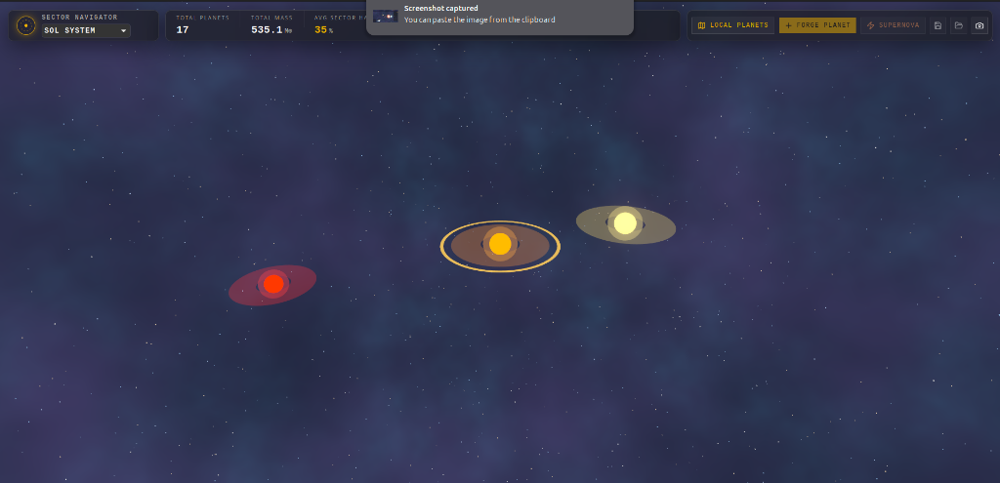
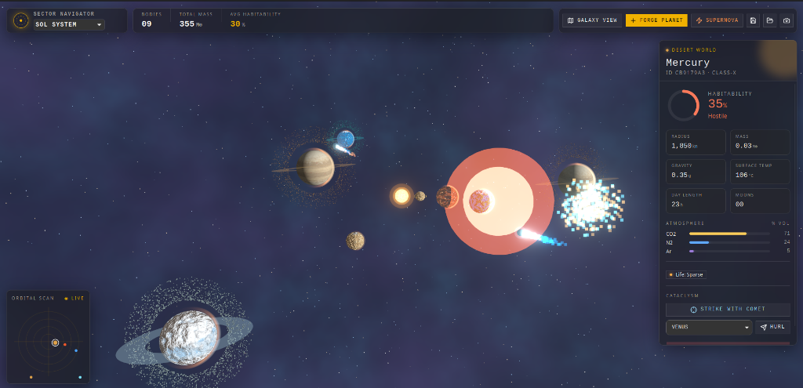
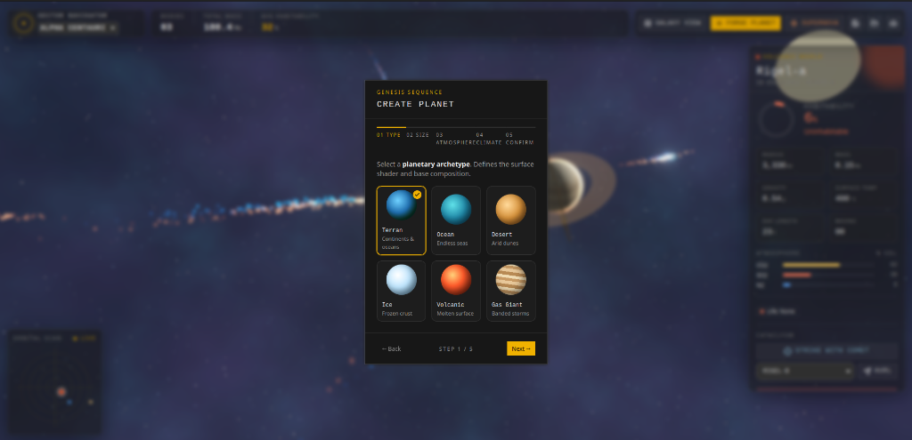

# 🪐 Planet Forge

**An interactive solar-system sandbox and cataclysm simulator.** Forge planets, fling
them into one another, send comets on intercept courses, and watch a star tear itself
apart in a supernova — all driven by a real physics engine and rendered with
GPU shaders.

Planet Forge ships as a single native desktop app (macOS, Linux, Windows) built with
**Tauri**, but its two halves are deliberately split by responsibility:

- a **Python** simulation core that owns the physics (gravity, orbits, collisions, stellar death), and
- a **React + Three.js** frontend that owns the rendering and UI.

They talk to each other over a local HTTP + WebSocket connection, and Tauri wraps the
whole thing into one installable binary.

---

## 📸 Screenshots

Here is a visual tour of Planet Forge in action:

### 🌌 Sector Navigator (Galaxy Overview)

*The Sector Navigator interface showing all currently available solar systems in the quadrant. Users can monitor macro-level sector statistics (such as total mass and average habitability) and select a system to navigate to.*

### 🪐 Active Solar System Sandbox

*A sample solar system (Sol System) showing active orbital lines, realistic planetary shading, an orbital scanner radar in the bottom-left, and a detailed physical analysis panel on the right for the selected celestial body (Mercury).*

### 🛠️ Planet Forge Wizard (Genesis Sequence)

*The interactive multi-step "Genesis Sequence" creation wizard. Users can forge new custom planets by selecting planetary archetypes (Terran, Ocean, Desert, Ice, Volcanic, Gas Giant) before customizing their physical attributes and launching them into orbit.*

---


## ✨ Features

- **Authoritative orbital physics** — symplectic (semi-implicit Euler) integration on game-scaled gravity, so orbits are stable and energy-conserving.
- **Collision engine** — bodies that touch trigger a cataclysm: comparable masses annihilate into two-coloured debris, a larger body absorbs a smaller one.
- **Supernova** — send a star through a `stable → expanding → remnant` death sequence that ejects/vaporises planets and collapses into a dim blue remnant.
- **Comet tools** — launch an impactor at any planet, or *hurl* one planet into another on an intercept course.
- **Ambient comets** — randomised fly-bys drift through the system with dual ion/dust "chemtrails".
- **Custom GLSL shaders** — animated stellar surfaces, procedural planet terrain/atmospheres/clouds, gas-giant storm bands, and particle-driven explosions with bloom post-processing.
- **Multiple star systems** — Sol, Kepler-186, and Alpha Centauri, plus a galaxy overview mode.

---

## 🏗 Architecture

```text
┌──────────────────────────── Tauri desktop app ────────────────────────────┐
│                                                                            │
│   Rust core (src-tauri)                                                    │
│   • owns the native window + OS webview                                    │
│   • spawns & supervises the Python sidecar, injects its port              │
│                                                                            │
│   ┌─────────────────────────┐         HTTP (REST)        ┌──────────────┐  │
│   │  Web frontend (webview)  │ ───────────────────────▶  │  Python sim  │  │
│   │  React + R3F + Three.js  │ ◀───────────────────────  │  (sidecar)   │  │
│   │  shaders · HUD · effects │   WebSocket  /stream       │  FastAPI     │  │
│   └─────────────────────────┘   (positions + events)     └──────────────┘  │
│         renders state                                       owns physics    │
└────────────────────────────────────────────────────────────────────────────┘
```

- The **Python sim** is the single source of truth. It steps the physics at a fixed
  timestep and broadcasts body positions plus transient **events** (collisions,
  supernovae, impacts) over a WebSocket at ~30 Hz. REST endpoints handle CRUD and
  trigger cataclysms.
- The **frontend** never computes physics. It subscribes to the stream, interpolates
  positions onto meshes, and reacts to events by spawning visual effects.
- The **Rust core** boots the sim as a child process in packaged builds and kills it
  when the window closes (see [`apps/web/src-tauri/src/lib.rs`](apps/web/src-tauri/src/lib.rs)).

---

## 🐍 The simulation core & its OOP design

The physics lives in [`apps/sim/sim/`](apps/sim/sim) and is built around a small,
classic object-oriented domain model. It is a deliberate showcase of the four pillars
of OOP:

### Abstraction

[`CelestialBody`](apps/sim/sim/domain/base.py) is an **abstract base class** (`ABC`) that
defines what *every* body in the universe can do — carry mass, position and velocity,
have a force applied (`apply_force`), and `integrate` its motion — while leaving
`derive_stats()` as an `@abstractmethod` that subclasses must implement. Callers depend
on this abstraction, not on concrete types.

### Inheritance

[`Planet`](apps/sim/sim/domain/planet.py) and [`Star`](apps/sim/sim/domain/star.py) both
**extend** `CelestialBody`, inheriting the shared state and physics machinery and adding
their own data (a planet's climate/atmosphere/rings; a star's luminosity and supernova
phase).

### Polymorphism

A `Star` is a `CelestialBody` whose motion is *fixed* — it **overrides** `integrate()`
and `apply_force()` to do nothing, so it stays anchored at the system's origin while
planets orbit it. Both subclasses implement `derive_stats()` differently. Because the
physics loop only knows about the base type, it can treat a heterogeneous list of bodies
uniformly — the correct behaviour is dispatched at runtime.

### Encapsulation

State and behaviour are bundled together and internals are kept private. The
[`SolarSystem`](apps/sim/sim/domain/system.py) hides its integration, collision
detection, orbit-spacing and spawn logic behind private helpers (`_gravitate`,
`_detect_collisions`, `_next_orbit_radius`, `_spawn_ambient`) and exposes a clean public
surface (`add_planet`, `step`, `launch_comet`, `trigger_supernova`, `drain_events`).

### Composition & aggregation

The model is layered by *has-a* relationships rather than deep inheritance:

```text
Galaxy ──has many──▶ SolarSystem ──has one──▶ Star
                                 ──has many──▶ Planet  (+ transient comets)
```

A [`SolarSystem`](apps/sim/sim/domain/system.py) **composes** a `Star` and a list of
`Planet`s and drives their physics; a [`Galaxy`](apps/sim/sim/domain/galaxy.py)
**aggregates** multiple systems and delegates `step()` / `drain_events()` down to each
one. Wire-format **DTOs** in [`models.py`](apps/sim/sim/models.py) (Pydantic) keep the
serialization/validation concern separate from the domain objects.

The result is code that reads like the problem domain and is easy to extend — adding a
new body type means subclassing `CelestialBody`, not editing the physics loop.

---

## 🤔 Why a web frontend instead of a Python renderer?

A natural question is: *if the physics is in Python, why not render it in Python too*
(pygame, VisPy, Panda3D, ModernGL…)?

We split the stack on purpose, matching each tool to what it is best at:

- **Rendering is GPU-shader work.** The look of Planet Forge — animated stellar
  granulation, procedural planet terrain and atmospheres, gas-giant storm bands,
  additive-blended particle explosions, bloom post-processing — is authored in **GLSL**
  and runs on the GPU. The web platform's **WebGL/Three.js** stack (via
  [React Three Fiber](https://r3f.docs.pmnd.rs/)) is a mature, batteries-included,
  hardware-accelerated renderer with a huge ecosystem (`drei`, `postprocessing`). Python
  3D bindings exist but are far less ergonomic for this kind of stylised, real-time,
  shader-heavy scene.
- **UI is a solved problem on the web.** The HUD, info panels, dialogs, and controls are
  built with React, Tailwind, and shadcn/ui — accessible, composable, and fast to iterate
  on. Reproducing that polish in a Python GUI toolkit would be a large step backwards.
- **Python is great at the *numerics*.** NumPy vector math and a clean OOP domain model
  make the physics readable and testable — that is exactly where Python earns its place.
- **Separation of concerns scales.** A networked boundary (HTTP/WebSocket) means the sim
  could later run remotely, be swapped out, or be reused by another client, without
  touching the renderer.

Tauri is what makes this split invisible to the user: the two processes are bundled into
a **single native app**, with the Python physics running as a local sidecar that the user
never has to install or even know about.

---

## 🦀 What is Tauri (and how does it package this app)?

[Tauri](https://tauri.app) is a framework for building cross-platform **desktop apps with
a Rust core and the operating system's native webview** — WebView2 (Edge/Chromium) on
Windows, WKWebView on macOS, and WebKitGTK on Linux. Crucially, it does **not** bundle a
copy of Chromium the way Electron does, so the resulting apps are dramatically smaller and
lighter on memory.

In Planet Forge, Tauri does three jobs:

1. **Hosts the UI.** It opens a native window and loads the compiled React/Three.js
   frontend into the system webview.
2. **Ships the Python physics as a "sidecar".** The Python sim is compiled to a
   self-contained executable with **PyInstaller**, named with the platform's Rust *target
   triple* (e.g. `planet-sim-aarch64-apple-darwin`, `planet-sim-x86_64-pc-windows-msvc.exe`).
   It is declared as an `externalBin` in [`tauri.conf.json`](apps/web/src-tauri/tauri.conf.json),
   so Tauri bundles the right binary per platform. The Rust core spawns it on startup,
   passes it a port via an env var, and terminates it on close — the end user needs **no
   Python installed**.
3. **Produces native installers.** `tauri build` compiles the Rust core, embeds the
   frontend assets and the sidecar, and emits OS-native packages:

   | OS | Artifacts |
   | --- | --- |
   | **macOS** | `.app` bundle + `.dmg` |
   | **Linux** | `.AppImage` + `.deb` + `.rpm` |
   | **Windows** | `.msi` + `.exe` (NSIS) |

---

## 🧰 Libraries & Tech Stack

Planet Forge leverages a modern, dual-language stack that combines high-performance GPU rendering and web-based UI tooling with a powerful OOP physics engine. Below are the key libraries and technologies that make this possible:

### Frontend & Rendering Layer (TypeScript / WebGL)

*   **[React 19](https://react.dev/)**: The foundation of the user interface, utilizing modern declarative rendering, component state, and the latest React 19 features.
*   **[React Three Fiber (R3F)](https://r3f.docs.pmnd.rs/)**: A React wrapper for Three.js that brings 3D scenes directly into React's declarative component model, making the canvas highly reactive to state updates.
*   **[Three.js](https://threejs.org/)**: The underlying production-grade WebGL engine used to manage our 3D pipelines, custom lighting, camera systems, and geometry meshes.
*   **[Tailwind CSS & shadcn/ui](https://ui.shadcn.com/)**: Powers the sleek, glassmorphic desktop HUD, interactive modal wizards, telemetry debuggers, and responsive design systems.
*   **[TanStack Router](https://tanstack.com/router/)**: Provides type-safe navigation and client-side routing between the sector navigation view and the sandbox canvases.
*   **[TanStack Query (React Query)](https://tanstack.com/query/)**: Orchestrates remote state synchronization, server-side data fetching, and smart polling with automatic backoff.
*   **[@react-three/postprocessing](https://github.com/pmndrs/react-postprocessing)**: Powers cinematic graphics, including screen-space bloom filters to simulate stellar glow, shockwave distortions, and color gradients.

### Physics, API & Simulation Core (Python)

*   **[FastAPI](https://fastapi.tiangolo.com/)**: A robust, modern web framework used to expose high-performance REST APIs and real-time WebSocket streams, broadcasting telemetry data at a stable 30 Hz.
*   **[NumPy](https://numpy.org/)**: A high-performance scientific computing library that drives all physical coordinate vector operations and n-body integration calculations using C-accelerated array structures.
*   **[Pydantic](https://docs.pydantic.dev/)**: Handles data parsing, validation, and JSON serialization DTOs, ensuring tight schema parity between the Python core and TypeScript client.
*   **[Uvicorn](https://www.uvicorn.org/)**: A high-performance ASGI server that hosts the FastAPI application with low-overhead execution.

### Desktop Shell & Tooling

*   **[Tauri 2 (Rust)](https://tauri.app/)**: The application wrapper that opens native OS windows and spawns, monitors, and stops the Python sidecar process dynamically.
*   **[PyInstaller](https://pyinstaller.org/)**: Compiles the entire Python environment, interpreter, and libraries into a single, optimized platform-specific standalone binary executable.
*   **[Ultracite (Biome)](https://github.com/biomejs/biome)**: Our zero-config quality control engine, automatically resolving formatting and enforcing linting standard compliance.
*   **[uv](https://docs.astral.sh/uv/)**: A fast Python resolver used to build virtual environments and lock dependencies instantly.

---

## 🧮 Physics & Formulas

The math and physics governing the Planet Forge universe are highly realistic. The simulation uses **Newtonian Gravity**, **Symplectic Euler Integration** (for long-term orbit preservation), momentum conservation algorithms for planetary merges, and Keplerian orbital speed approximations for rings and moons.

👉 **Read the full [Physics & Calculations Reference](docs/formulas_documentation.md) for detailed mathematical equations and derivations.**

---

## 📁 Repository layout

```text
planet-forge/
├── apps/
│   ├── sim/                    # Python physics engine + FastAPI server
│   │   ├── sim/
│   │   │   ├── domain/         # OOP model: base, star, planet, system, galaxy, presets
│   │   │   ├── models.py       # Pydantic DTOs (wire format)
│   │   │   └── main.py         # FastAPI app: REST + /stream WebSocket + seeding
│   │   ├── tests/              # pytest suites (orbits, collisions, presets)
│   │   └── scripts/bundle.sh   # PyInstaller → Tauri sidecar
│   └── web/                    # React + Three.js frontend
│       ├── src/features/planet-forge/
│       │   ├── scene/          # Canvas, shaders, planets, comets, effects
│       │   ├── hud/            # Toolbar, info panel, minimap
│       │   └── lib/            # API client, simulation socket, types
│       └── src-tauri/          # Rust desktop core + Tauri config
├── packages/
│   └── ui/                     # Shared shadcn/ui primitives and styles
└── .github/workflows/build.yml # Cross-platform release pipeline
```

---

## 🚀 Getting started

### Prerequisites

- [**Bun**](https://bun.sh) (package manager + task runner)
- [**uv**](https://docs.astral.sh/uv/) (Python 3.12 environment for the sim)
- [**Rust**](https://rustup.rs) + the [Tauri system dependencies](https://tauri.app/start/prerequisites/) for your OS (only needed to build/run the desktop app)

### Install

```bash
bun install                 # JS workspaces
cd apps/sim && uv sync       # Python sim environment
```

### Run in development

**Desktop app (recommended)** — starts the Python sim *and* the Tauri window together:

```bash
bunx nx run web:desktop:dev
```

**Browser only** — run the two halves in separate terminals:

```bash
bunx nx run sim:serve        # FastAPI sim on http://127.0.0.1:8000
bun run dev:web              # Vite dev server on http://localhost:3001
```

> In a plain browser dev session the frontend retries its API calls with backoff and
> refetches the moment the WebSocket connects, so it populates as soon as the sim is up.

---

## 📦 Building the desktop app locally

```bash
bunx nx run web:desktop:build
```

This runs `sim:bundle` (PyInstaller → a target-triple-named sidecar in
`apps/web/src-tauri/binaries/`), builds the frontend, then runs `tauri build` to produce
installers under `apps/web/src-tauri/target/release/bundle/`.

---

## 🤖 Releases & CI

Cross-platform installers are produced automatically by
[`.github/workflows/build.yml`](.github/workflows/build.yml), which runs a matrix across
macOS, Ubuntu, and Windows. For each platform it:

1. bundles the Python sim into a native sidecar with PyInstaller,
2. builds the frontend and compiles the Tauri app, and
3. publishes the resulting installers as a **GitHub Release**.

### Cutting a release

1. Add a section for the new version to [CHANGELOG.md](CHANGELOG.md) (the workflow
   publishes the matching `## [x.y.z]` block as the release notes).
2. Bump the version in [`apps/web/src-tauri/tauri.conf.json`](apps/web/src-tauri/tauri.conf.json)
   and [`apps/web/src-tauri/Cargo.toml`](apps/web/src-tauri/Cargo.toml) to match.
3. Commit, then tag and push:

```bash
git tag v0.1.3
git push origin v0.1.3
```

The workflow builds all three platforms and attaches their installers to a release named
after the tag (it can also be run manually from the **Actions** tab via *workflow_dispatch*).

> **Code signing:** these builds are **ad-hoc signed, not notarized** (no paid Apple
> Developer ID). On macOS, open it the first time with **right-click → Open** (or System
> Settings → Privacy & Security → **Open Anyway**); if it was already quarantined run
> `xattr -dr com.apple.quarantine "/Applications/Planet Forge.app"`. On Windows, click
> **More info → Run anyway** on the SmartScreen prompt.

---

## ✅ Testing & quality

```bash
# Python physics tests
cd apps/sim && uv run pytest

# Python lint (Ruff)
bunx nx run sim:lint

# TypeScript type-check
bun run check-types

# Format + lint the JS/TS workspace (Biome via Ultracite)
bun run check
```

---

## 📜 License

See repository settings. Scaffolded with
[Better-T-Stack](https://github.com/AmanVarshney01/create-better-t-stack).
